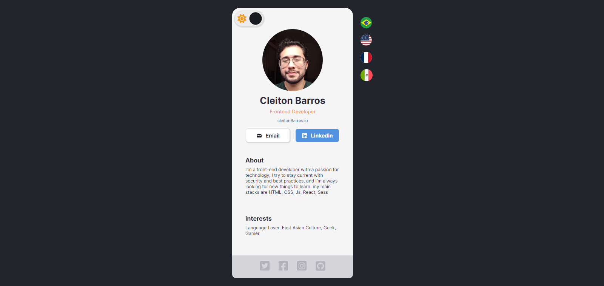

# Profile Card 

## 🚀 Dark Mode
<h1 align="center">
  
</h1>

## 🚀 Light Mode
<h1 align="center">
  
</h1>

## 🚀 Mobile
<h1 align="center">
  
</h1>

## 🚀 Tecnologias

Esse projeto foi desenvolvido com as seguintes tecnologias:

  - React
  - Vite
  - CSS 
  - HTML
  - JS
  - i18n

## 💻 Projeto

  - Projedo desenvovido em react, proposto como primeiro challange do curso de react na [Scrimbra](https://scrimba.com/learn/learnreact).
  - Um card disponibilizando informações basicas sobre mim.
  - Dark e Light mode usando useState
  - Multi idiomas (português, inglês, espanhol. Francês)
    
## 🔖 Layout
Você pode visualizar o projeto  através [desse link](https://profile-card-tau-sooty.vercel.app/).
